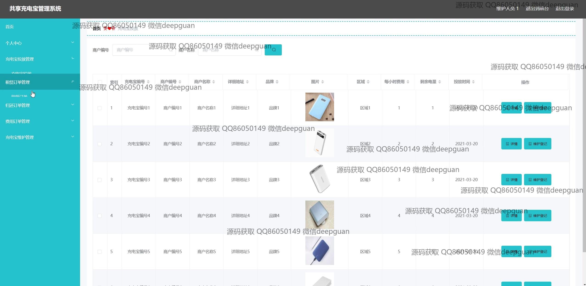
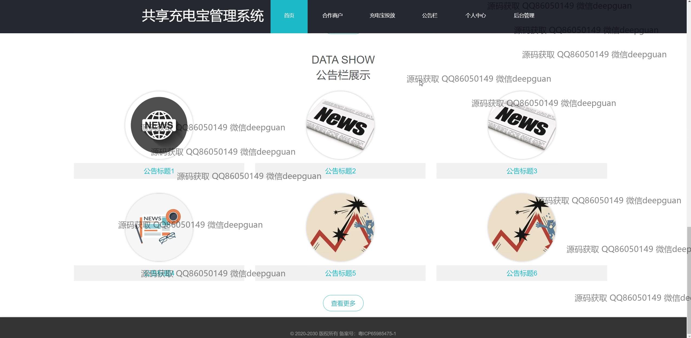

<h1 align="center">的共享充电宝管理系统vue</h1>

## 简介
共享充电宝管理系统：角色分为管理员和用户；功能包括用户管理、区域信息管理、订单管理、充电宝投放管理、合作商户管理及公告发布等模块，支持用户信息编辑、订单追踪和充电宝维护。    --计算机毕业设计源码；毕设源码；java毕业设计源码

## 联系方式

<h3 align="center">获取完整代码与数据库文件 + 微信：deepguan QQ: 86050149 QQ群: 783742310</h3>

<h3 align="center">可帮忙远程部署 包运行成功！提供远程部署、修改代码、设计文档指导、代码讲解等服务！</h3>

## 功能介绍（完整见运行截图）
管理员：基本功能包括登录、注册和退出。管理员可以在网站首页通过主导航栏访问各个管理模块，如用户管理、区域信息管理、合作商管理、充电宝投放管理和订单管理。系统提供了用户信息编辑和维护人员信息管理功能，并可以对租赁和费用订单进行全方面管理。管理员还可发布查看公告，管理广告轮播图，核查充电宝设备及其投放信息，确保系统高效运营。

用户：用户的基本功能为登录、注册和退出。用户可以通过个人中心查看和修改个人信息，包括账号、昵称、年龄、性别和联系方式，并上传头像。系统支持用户浏览及管理租赁订单、费用订单和相关公告信息。用户可通过主页和导航菜单参与交互，获取充电宝使用情况、高效利用共享充电宝资源，提升用户体验。

合作商户：合作商户模块允许管理者查看和编辑与合作商相关的信息，包括商户名称、编号和投放充电宝的详细信息。系统界面提供筛选和分页功能，方便浏览多个商户，确保管理效率。管理员可以通过该模块追踪合作商户的运营情况和充电宝设备的配置，从而进行业务合作优化。

## 运行截图

本代码来源于网络,仅供学习参考使用!

